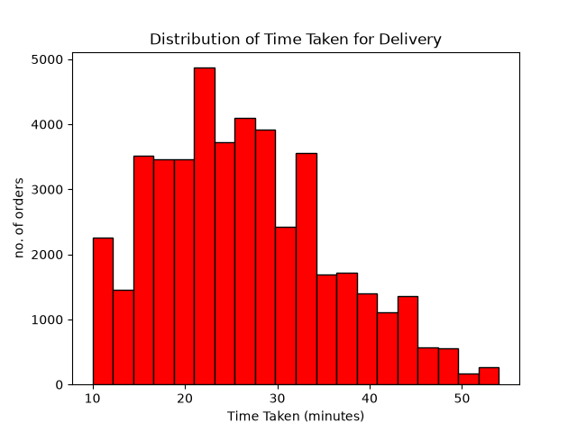
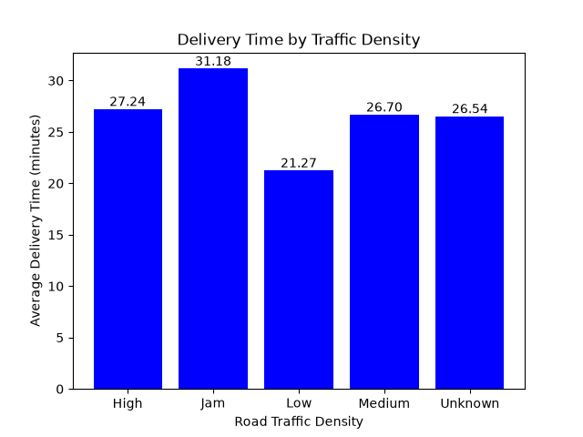
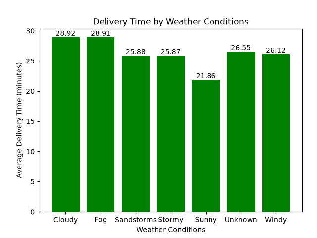
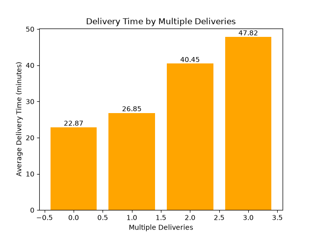
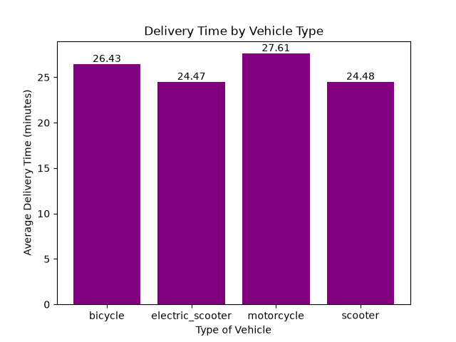
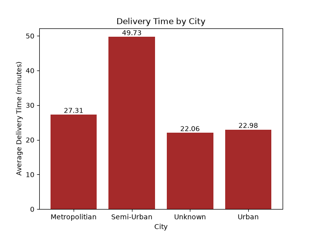
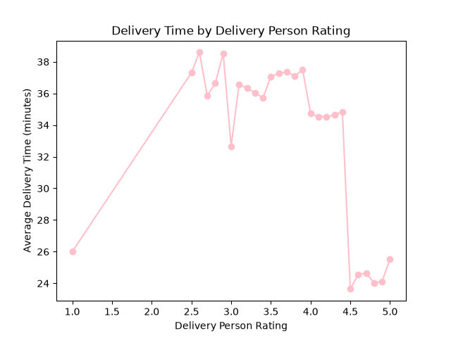
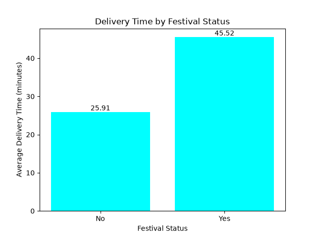
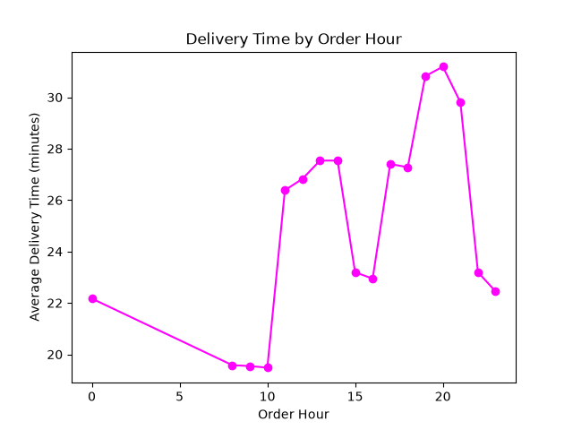

# 🍔 Food Delivery Operations & Performance Analysis

### Data Analyst Portfolio Project | Python • SQL • Power BI

An end-to-end data analytics project focused on analyzing food delivery operations, identifying factors associated with longer delivery times, and converting analytical findings into actionable business recommendations.

---

## 📌 Project Overview

This project analyzes **45,584 food-delivery orders** to understand delivery performance and identify operational factors associated with longer delivery times.

The analysis focuses on:

* 🚦 Road traffic density
* 🌦️ Weather conditions
* 📦 Multiple deliveries
* 🛵 Vehicle type
* 🏙️ City
* ⭐ Delivery-person ratings
* 🎉 Festival periods
* 🕐 Order hour

The project follows an end-to-end Data Analyst workflow:

```text
Raw Data
   ↓
Python Data Cleaning
   ↓
Exploratory Data Analysis
   ↓
SQL Business Analysis
   ↓
Power BI Dashboard
   ↓
Business Insights
   ↓
Recommendations
```

---

# 📊 Key Performance Metrics

| Metric                      |     Value |
| --------------------------- | --------: |
| **Total Orders**            |    45,584 |
| **Delayed Orders**          |     1,562 |
| **Delay Rate**              |     3.43% |
| **Timely Orders**           |    44,022 |
| **Average Delivery Time**   | 26.29 min |
| **Average Delivery Rating** |      4.64 |
| **Unique Delivery Persons** |     1,320 |

---

# 🛠️ Tech Stack

| Tool           | Purpose                                   |
| -------------- | ----------------------------------------- |
| **Python**     | Data cleaning & exploratory data analysis |
| **Pandas**     | Data manipulation & transformation        |
| **NumPy**      | Numerical operations                      |
| **Matplotlib** | Data visualization                        |
| **Seaborn**    | Exploratory visualization                 |
| **MySQL**      | Business-oriented SQL analysis            |
| **Power BI**   | Interactive dashboard & KPI reporting     |

---

# 📁 Repository Structure

```text
Food-Delivery-Operations-Analysis/
│
├── data/
│   ├── raw/
│   │   └── food_delivery.csv
│   │
│   └── cleaned/
│       └── food_delivery_cleaned.csv
│
├── python/
│   ├── data_cleaning.py
│   ├── eda_analysis.py
│   └── screenshots/
│       ├── delivery_time_distribution.png
│       ├── traffic_delivery_time.png
│       ├── weather_delivery_time.png
│       ├── multiple_deliveries.png
│       ├── vehicle_delivery_time.png
│       ├── city_delivery_time.png
│       ├── rating_delivery_time.png
│       ├── festival_delivery_time.png
│       └── hourly_delivery_time.png
│
├── sql/
│   └── food_delivery.sql
│
├── power_bi/
│   ├── food_delivery_dashboard.pbix
│       ├── dashboard_overview.png
│
├── report/
│   └── Food_Delivery_Operations_Performance_Report.pdf
│
└── README.md
```

---

# 🧹 Data Cleaning

Python and Pandas were used to prepare the raw dataset for analysis.

### Key Cleaning Steps

* Inspected dataset structure, shape, and data types
* Standardized column names
* Renamed `time_taken (min)` to `time_taken_min`
* Handled mixed-format time fields
* Corrected pickup times beginning with `24:`
* Handled missing categorical values
* Replaced missing `multiple_deliveries` values with `0`
* Converted `multiple_deliveries` to integer
* Converted `order_date` to datetime
* Validated delivery-person age values
* Handled invalid delivery-person ratings outside the 1–5 range
* Created a delivery-time clock field
* Exported the cleaned dataset for SQL, EDA, and Power BI

The cleaned dataset is available in:

```text
data/cleaned/food_delivery_cleaned.csv
```

---

# 📈 Exploratory Data Analysis

Python was used to explore delivery-time patterns and identify operational factors associated with longer delivery times.

The EDA contains **9 key analyses**.

---

## 1. Delivery Time Distribution

### Business Question

**What is the distribution of delivery time?**

Delivery time ranges from **10 to 54 minutes**, with most orders concentrated approximately between **15 and 35 minutes**.

The overall average delivery time is **26.29 minutes**, while **1,562 of 45,584 orders** exceed 45 minutes.

### Visualization



---

## 2. Traffic Density vs Delivery Time

### Business Question

**How does delivery time vary by traffic density?**

Traffic conditions show a clear difference in average delivery time.

* **Jam:** 31.18 minutes
* **Low:** 21.27 minutes

This suggests that road congestion is an important operational factor associated with longer delivery times.

### Visualization



---

## 3. Weather vs Delivery Time

### Business Question

**How does weather affect delivery time?**

* **Cloudy:** 28.92 minutes
* **Fog:** 28.91 minutes
* **Sunny:** 21.86 minutes

Cloudy and Fog conditions have the highest average delivery times among the reported categories.

### Visualization



---

## 4. Multiple Deliveries vs Delivery Time

### Business Question

**How do multiple deliveries affect delivery time?**

| Multiple Deliveries | Average Delivery Time |
| ------------------: | --------------------: |
|                   0 |             22.87 min |
|                   1 |             26.85 min |
|                   2 |             40.45 min |
|                   3 |             47.82 min |

Average delivery time increases substantially as the number of simultaneous deliveries increases.

### Visualization



---

## 5. Vehicle Type vs Delivery Time

### Business Question

**How does delivery time vary by vehicle type?**

| Vehicle Type     | Average Delivery Time |
| ---------------- | --------------------: |
| Motorcycle       |             27.61 min |
| Electric Scooter |             24.47 min |
| Bicycle          |             26.43 min |

Bicycle represents only **68 orders**, so it was excluded from the combined Power BI vehicle-performance visual for readability and sufficient-volume comparison.

### Visualization



---

## 6. City vs Delivery Time

### Business Question

**How does delivery time vary by city?**

| City Category | Average Delivery Time |
| ------------- | --------------------: |
| Semi-Urban    |             49.73 min |
| Metropolitan  |             27.31 min |
| Urban         |             22.98 min |
| Unknown       |             22.06 min |

Semi-Urban has the highest average delivery time, but it contains only **164 orders**, so the result should be interpreted carefully.

### Visualization



---

## 7. Delivery Rating vs Delivery Time

### Business Question

**How does delivery time vary by delivery-person rating?**

The analysis shows a noticeable change in delivery time across rating groups, with higher-rating groups generally associated with lower average delivery times.

However, some rating groups have small order counts, so the relationship should be treated as **directional rather than causal**.

### Visualization



---

## 8. Festival Status vs Delivery Time

### Business Question

**How does delivery time vary by festival status?**

| Festival Status | Average Delivery Time |
| --------------- | --------------------: |
| Festival        |             45.52 min |
| Non-Festival    |             25.91 min |

Festival periods are associated with substantially higher average delivery times.

### Visualization



---

## 9. Order Hour vs Delivery Time

### Business Question

**How does delivery time vary by order hour?**

* **Lowest:** Around 10:00 → 19.48 minutes
* **Highest:** Around 20:00 → 31.19 minutes

Evening hours show higher average delivery times than the late-morning period.

### Visualization



---

# 🗄️ SQL Business Analysis

SQL was used to answer business-focused questions from the cleaned dataset.

### Business Questions

1. What are the top 3 delivery persons in each city based on average delivery performance, considering only delivery persons with a minimum number of orders?

2. Which delivery persons show the greatest improvement in delivery performance from one month to the next?

3. Which cities have the highest and lowest average delivery time, and how many orders does each city handle?

4. What percentage of delayed orders does each city have?

5. Who is the best delivery person among those with at least 50 orders?

6. Which traffic and weather combination has the longest average delivery time?

7. How does delivery performance change month-over-month, and which month shows the biggest increase or decrease in average delivery time?

8. Which vehicle type and vehicle condition provide the best performance with at least 100 orders?

### SQL Concepts Used

```text
GROUP BY
HAVING
CASE
CTEs
JOINs
UNION ALL
Window Functions
LAG
DENSE_RANK
Date Functions
Aggregations
```

SQL queries are available in:

```text
sql/food_delivery_analysis.sql
```

---

# 📊 Power BI Dashboard

The Power BI dashboard converts the analysis into an interactive management-style report.

### Dashboard KPIs

* Total Orders
* Delayed Orders
* Delay Rate
* Timely Orders
* Average Delivery Time
* Average Delivery Rating

### Dashboard Analysis

* Monthly delivery-time trends
* Monthly order volume
* Delivery performance by city
* Traffic density impact
* Vehicle performance
* Overall operational performance

---

## 📷 Power BI Dashboard — Overview


---

## 📷 Power BI Dashboard — Analysis


---

# 💡 Key Business Insights

### 🚦 Traffic

Jam traffic has an average delivery time of **31.18 minutes**, compared with **21.27 minutes** under Low traffic.

### 📦 Multiple Deliveries

Average delivery time increases from **22.87 minutes** with no multiple deliveries to **47.82 minutes** with three simultaneous deliveries.

### 🎉 Festivals

Festival orders average **45.52 minutes**, compared with **25.91 minutes** for non-festival orders.

### 🌦️ Weather

Cloudy and Fog conditions have the highest average delivery times at approximately **29 minutes**.

### 🏙️ City

Semi-Urban has the highest average delivery time at **49.73 minutes**, but the category contains only **164 orders**.

### 🛵 Vehicle

Motorcycles average **27.61 minutes**, while Electric Scooters average **24.47 minutes**.

### 🕐 Peak Hours

Average delivery time reaches approximately **31.19 minutes around 20:00**, compared with **19.48 minutes around 10:00**.

---

# 🎯 Business Recommendations

### 1. Optimize Peak-Hour Operations

Increase delivery capacity and improve delivery-person allocation during evening peak hours.

### 2. Review Multiple-Delivery Batching

Multiple deliveries are strongly associated with longer delivery times. Batching rules should therefore be reviewed to balance efficiency and customer wait time.

### 3. Prepare for Festival Demand

Festival periods show substantially higher delivery times, suggesting the need for additional operational capacity during high-demand periods.

### 4. Monitor Traffic Conditions

Traffic-related delays can be reduced through better delivery allocation and peak-period planning.

### 5. Investigate Semi-Urban Performance

Semi-Urban shows the highest average delivery time, but the relatively small number of orders means further validation is required.

### 6. Evaluate Vehicle Performance

Vehicle performance should be assessed together with order volume and vehicle condition rather than relying only on average delivery time.

### 7. Improve Data Quality

Continue monitoring missing and unknown categorical values to ensure operational decisions are based on reliable data.

---

# ⚠️ Data Quality & Limitations

* City, weather, traffic, and other categorical fields contain `Unknown` values after cleaning.
* Bicycle has only **68 orders**.
* Semi-Urban has only **164 orders**.
* Some delivery-person rating groups have small order counts.
* The observed order dates cover **February–April**, so the results should not be generalized as full-year seasonality.
* Observed relationships should not automatically be interpreted as causal.
* This is a portfolio/learning project, so recommendations should be validated against operational and business context before implementation.

### Analytical Principle

> **A high or low average is not enough by itself. Order volume, missing values, and category context should be considered before turning an observed pattern into a business decision.**

---

# 🧠 Skills Demonstrated

### Python

* Pandas
* NumPy
* Data Cleaning
* Data Validation
* Datetime Handling
* Missing-Value Treatment
* GroupBy
* Aggregation

### Data Visualization

* Matplotlib
* Seaborn
* Histograms
* Bar Charts
* Line Charts
* Data Labels
* Comparative Analysis

### SQL

* GROUP BY
* HAVING
* CASE
* CTEs
* JOINs
* UNION ALL
* LAG
* DENSE_RANK
* Window Functions
* Date Functions
* Aggregations

### Power BI

* KPI Cards
* Measures
* Slicers
* Trend Charts
* Bar Charts
* Combination Charts
* Dashboard Design
* Interactive Reporting

### Business Analysis

* KPI Interpretation
* Operational Driver Analysis
* Performance Comparison
* Sample-Size Awareness
* Business Recommendations

---

# 🔄 End-to-End Analytical Process

```text
1. Understand the Business Problem
              ↓
2. Inspect Raw Data
              ↓
3. Clean & Validate Data using Python
              ↓
4. Perform Exploratory Data Analysis
              ↓
5. Answer Business Questions using SQL
              ↓
6. Build Interactive Power BI Dashboard
              ↓
7. Identify Key Operational Insights
              ↓
8. Provide Business Recommendations
```

---

# 🗣️ Interview-Ready Project Summary

> I worked on a food delivery operations and performance analysis project using 45,584 order records. I first used Python and Pandas to inspect and clean the data, including standardizing time fields, handling missing categorical values, validating age and rating ranges, and preparing the dataset for analysis.
>
> I then used SQL to answer business questions related to city performance, delayed orders, delivery-person performance, traffic and weather combinations, month-over-month delivery time, and vehicle performance.
>
> Finally, I built a Power BI dashboard with KPI cards and operational visuals to present the findings.
>
> The analysis showed that traffic congestion, multiple deliveries, festival periods, and evening hours were associated with longer delivery times. Based on these findings, I recommended improving peak-hour capacity, reviewing batching practices, planning for festival demand, and monitoring operational performance.

---

# 📂 Project Files

| Folder                  | Contents                              |
| ----------------------- | ------------------------------------- |
| `data/raw/`             | Original food-delivery dataset        |
| `data/cleaned/`         | Cleaned dataset prepared for analysis |
| `python/`               | Data cleaning and EDA Python scripts  |
| `python/screenshots/`   | EDA visualization screenshots         |
| `sql/`                  | SQL business-analysis queries         |
| `power_bi/`             | Power BI dashboard file               |
| `power_bi/screenshots/` | Power BI dashboard screenshots        |
| `report/`               | Detailed project report               |

---

# 📄 Project Report

A detailed PDF report is included in the `report/` folder.

The report covers:

* Project Overview
* Dataset & Data Preparation
* Python Data Cleaning
* Exploratory Data Analysis
* SQL Analysis
* Power BI Dashboard
* Key Business Insights
* Business Recommendations
* Data Quality & Limitations
* Analyst Methodology
* Interview-Ready Project Explanation

---

# 🚀 Project Outcome

This project demonstrates a complete **Data Analyst workflow** from raw data to business recommendations.

```text
Clean → Explore → Query → Visualize → Interpret → Recommend
```

The goal was not only to create charts and dashboards, but to use data to identify operational patterns and translate those findings into practical business insights.

---

## ⭐ Portfolio Project

**Project Type:** Data Analyst Portfolio Project
**Domain:** Food Delivery & Operations
**Dataset Size:** 45,584 Orders
**Unique Delivery Persons:** 1,320
**Tools:** Python • SQL/MySQL • Power BI
**Primary Focus:** Delivery Operations & Performance Analysis


